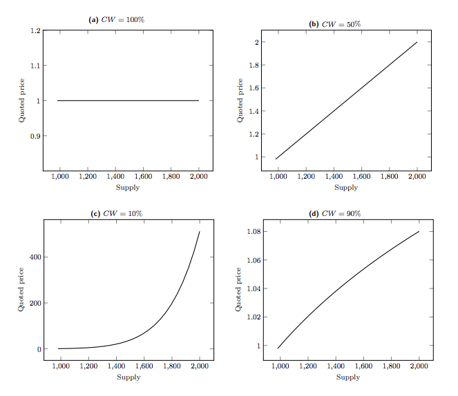
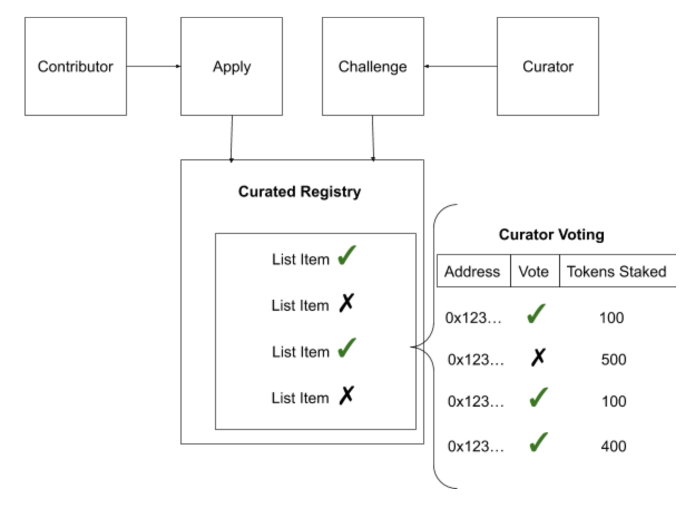
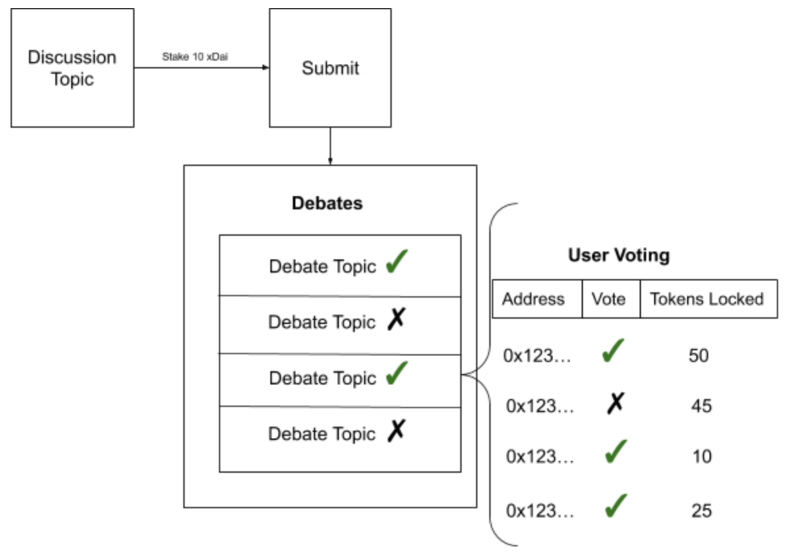
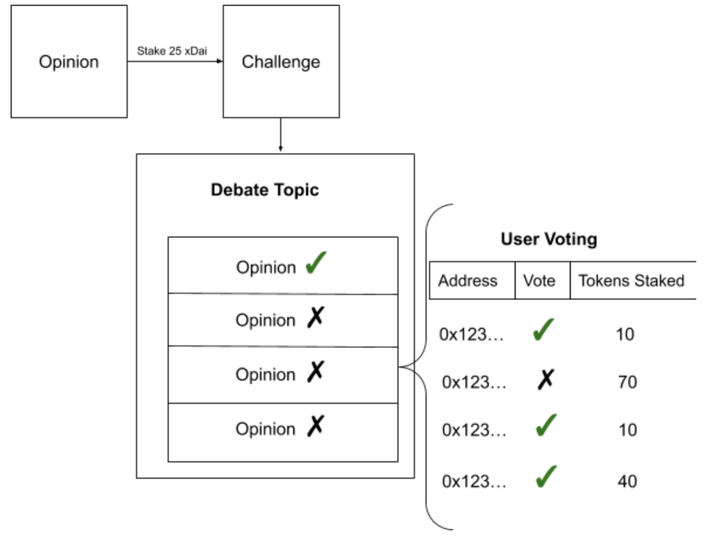
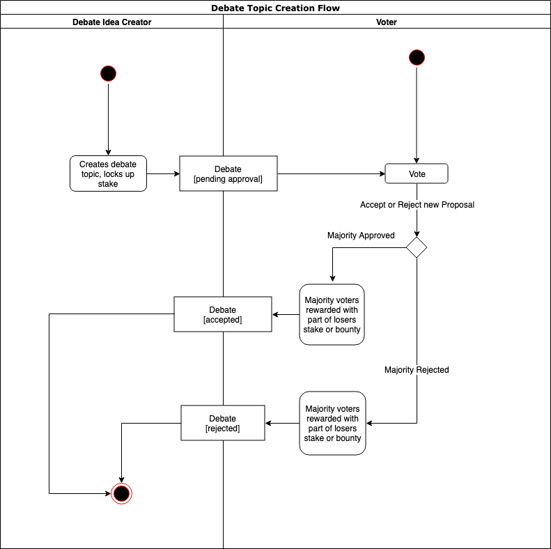
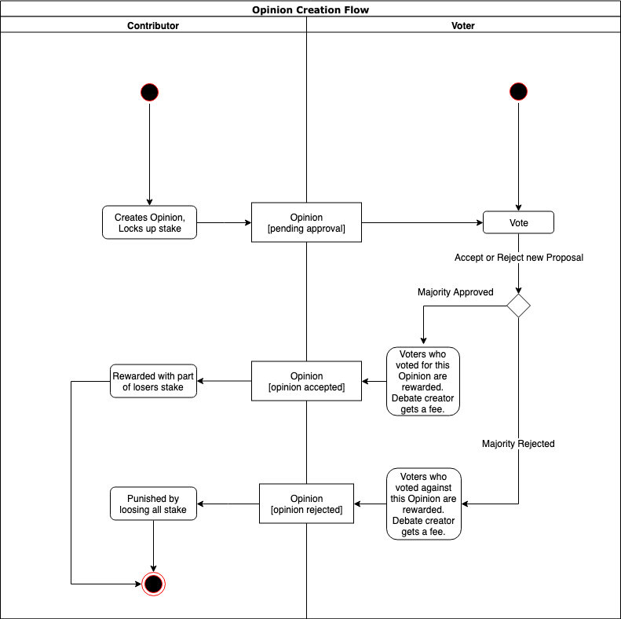
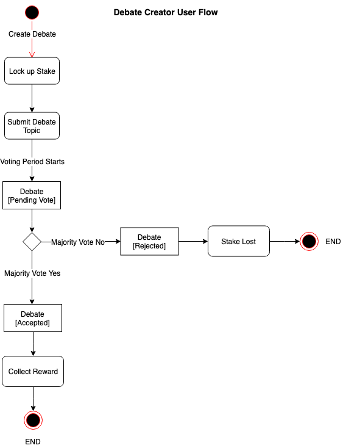
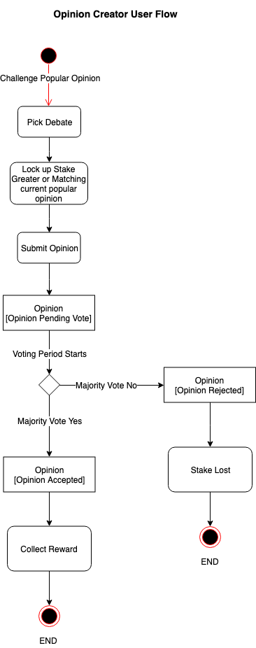
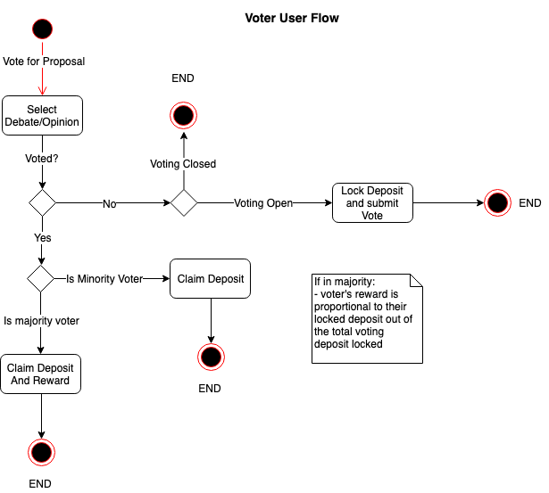

# DAIS social network
>Engineering the right incentives for modern social networks

## Abstract
Modern social networks profit from its user’s data and content but give virtually nothing back to the individuals for their contribution. However the latest developments in blockchain technologies, crypto-economics, side-chains and user-experience solutions, allow us to engineer new forms of social media networks, where all the participants can be incentivized to participate and contribute quality content and receive real economic rewards based on the value they provide to the network. DAIS is a fully autonomous and self governed social debate network that leverages game theory and crypto economics to incentivize user participation and content curation. No idea is censored. All topics are welcome. And every user is anonymous by default. 

## Problem Statement
### Issues With Current Social Networks
Many issues exist today with social networks. Especially since most were built almost a decade ago and they have not evolved over time. Corporate structure, closed source code practices and government regulations often stifle innovation, progress and natural evolution these networks need to grow. The following problems are some of the concerns with modern social networks today:

#### Centralization of decision making
Decisions that affect every user of the platform are often made by a select few. The majority of the users have no power to influence policies and decisions of the platform’s owners.
#### Censorship
Due to government regulations and executive decisions, most companies take on the role of censoring and filtering the content on their platforms. Often only showing content they approve of based on their own policies and guidelines, and remove the content they see as problematic.
#### Unfair value distribution
While the users create all the content on the platform, the company behind the social network ends up with most of the profits. Because of the corporate rules and governmental regulations, platform owners are forced to take on many roles and tasks, creating inefficient structure of leadership and governance. These inefficiencies eat up a lot of the profits that have been created by the users and leave very little to reward the content creators.
#### Echo chambers 
Most social network companies curate the content for each user in order to show them the content they are already interested in. They create echo chambers where the users end up seeing only the content they already know and agree with. Resulting in users only seeing one side of the story or debate; often missing the whole picture.
#### Lack of transparency
There are two major disadvantages of closed source software. First is lack of transparency; meaning the user is unaware if the software is performing any unwanted actions, such as tracking or collecting sensitive information. And second, closed source software stifles innovation, as community members cannot propose improvements, or review the software for potential issues.
### Issues With Blockchain Proposed Solutions
 Over the last couple years some social media projects have been created on top of decentralized cryptocurrency platforms as they paved the way for future innovation. But there are a few common issues with these projects:

#### Poor UX
Smart contracts and blockchain based platforms are still in their infancy. Because of the complex nature of these platforms the tools and user interfaces are still very complex for most average users to navigate. “How do I fund my account with crypto currency? What is gas? Why are my transactions taking so long?” All are common questions an average person encounters when trying to use a decentralized application (dapp) .
#### Slow transaction times
When interacting with a dapp on Ethereum, the transaction times are on average between 20-30 seconds [1]. This is a long wait for a user who is not familiar with dapps. Most users can get impatient or frustrated if the wait times are nearly half a minute long as they are used to 1-2 second wait times on most websites.
#### Steep learning curve
A new user of a dapp has to go through a long process of converting fiat to crypto through an exchange where they need to submit personal information, figure out how to buy and then withdraw their currency. Then the user has to learn how to interact with a dapp; that usually involves installing a browser extension and transferring some amount of crypto there. All the previous steps can take a few hours and a lot of research before the user is finally ready to use the dapp. Most users are simply not willing to commit so much time and effort to try any web platform. 
#### Centralization
Even though a social media dapp platform is built on top of a decentralized system, the creators still have too much control over the content. In addition the creators are often required to comply with the rules and regulations of the country they are located in and therefore have to make sure the content does not violate any government rules.

## Background
Before we continue to the proposed solution, having a basic understanding of the following concepts is important as they play a key role in the DAIS network:

### Stable Coins
   To understand stable coins, we must first understand the issues that created the need for them in the first place. All cryptocurrencies are subject to speculation and therefore volatility. Building a decentralized project is challenging when your budget and your currency reserves fluctuate drastically day to day. A stablecoin is a cryptocurrency created out of the need to minimize volatility of the price of the stablecoin, but keep all the other properties of a cryptocurrency. A stable coin can be pegged to a currency, or an exchange traded commodity. The different types of stablecoins range from fiat-collateralized to crypto-collateralized. The latter being more preferable solution as the crypto ecosystem trends towards more open and decentralized approach. An example of a decentralized stable coin is Dai by MakerDAO[2]. Dai token is minted by a smart contract when a user locks up a deposit of Ethereum and in return receives a part of the value of Ethereum in Dai (1Dai=$1), as a loan of sorts. To receive the locked Ethereum back the user must pay back the inital Dai loan. The value of Dai token is balance by market dynamics. For example, if the value of Dai drops below $1 then it is cheaper to pay off Dai loans, therefore a user can buy cheaper Dai per dollar and close some of their outstanding positions, consequently, decreasing the supply of Dai in circulation and increasing the price back to $1. On the other hand if Dai increases above 1$ then it is advantageous for the users to create more Dai loans as they will be receiving more Dai in dollar amounts then their underlying asset actually costs thus increasing the supply of Dai and in return bringing the price back to 1$. Dai project has been running with no major issues for over a year and resulted in almost 2% of Ethereum’s supply being locked in their smart contract while maintaining a close peg to the USD.

### xDai Network
xDai[3] is a blockchain developed through a partnership between POA Network and MakerDAO. MakerDAO is a decentralized organization behind the DAI stable coin. xDai is a Proof of Autonomy blockchain with 5 second block times and fixed 1Gwei (<1¢) gas price. xDai Chain uses Proof of Autonomy consensus. Proof of Autonomy resembles Proof of Authority, but validators are managed by a DAO instead of a centralized authority.  xDai Chain is a separate blockchain that operates as an Ethereum sidechain where the xDai is the chain’s native token. xDai is a 1:1 representation of MakerDAO’s Dai stablecoin. Users can convert Dai to xDai via POA Network’s TokenBridge, which connects Ethereum and xDai Chain.
### Bonding Curves
Bonding curve is an automated market maker that sells or buys a specific token at a calculated price. Bonding curves are implemented as smart contracts, whose role is adjusting token supply based on reserve currency amount. Users can buy tokens by depositing reserve currency, and in response increasing the token price in terms of reserve currency. Users can also sell tokens by depositing them and receiving reserve currency at the current exchange rate, in response decreasing the token price. Price curves can have different rates of slope change depending on the initial formula: 

A price formula can be expressed as:
> Continuous Token Price =
 Reserve Token Balance / (Continuous Token Supply x Reserve Ratio)

Bonding Curves provide liquidity to tokens where users wanting to purchase a token do not have to go through an exchange or trade with another user. This allows for unstoppable distribution of a token, where its price is regulated by a Bonding Curve contract according to the current supply/demand of the market. Bancor[4] was the project that pioneered the use of Bonding Curves in the crypto space. Bonding Curves provide unstoppable liquidity to tokens without the need of exchanges or peer to peer transactions.
### Token Curated Registry
Lists are a handy data structure that is very useful in organizing information such as: displaying news articles, Reddit posts, Yelp reviews, Tweets, etc. Although useful, contributors are forced to trust that the list owner is acting honestly. Centralized lists can censor contributors, remove list items and have flawed ranking methods. Additionally, these lists can fall victim to spam, fraudulent voting, and confirmation bias. A new type of crypto-economic primitive called Token Curated Registries[5] or TCR for short, aims to solve the problems mentioned previously. It will provide interesting crypto-economic incentives for users to create and curate high quality lists.  Each list uses a native coin or token ie. ERC20 token, Ether, xDai, etc. As a token holder, you are encouraged to maintain a high-quality, popular, or helpful list, to attract list applicants who want to add their item to the list. An example of a TCR can look like this:

The game theoretic rules of a common TCR pattern are as follows: In order to add an item to the list, an applicant must put down a stake. Token holders may challenge the new applicant or existing list items if they believe an item does not belong on a list. Challenges require a deposit to initiate. When a challenge is initiated, Token Holders may vote to either accept or reject the application. If the application is rejected then the stake amount gets split amongst the voters and the challenger. If the application is accepted the challenger’s stake gets split amongst the voters and the applicant. TCR’s give a blueprint to create platforms where the content is controlled by the users and the users are incentivized only to submit content of the highest quality. 
### Decentralized Autonomous Trust
Decentralized Autonomous Trusts or DATs[6] for short, were created to solve problems with crowdfunding for decentralized platforms. Instead of pre-selling tokens during a launch phase, tokens are minted continuously over time through a variation of a Bonding Curve contract. Tokens are minted as needed and used within the protocol or application when required. This structure allows for liquidity, taxation and fundraising during the sale of the tokens. Profits can be redistributed to token holders in a form of a dividends simply by increasing the reserves of the Bonding Curve, and as a result increasing the tokens price. Users can exchange their tokens at any time they wish, in return for reserve currency. The token represents a share of the company’s future utility or profit, making the token holders also stakeholders in the company.
### Decentralized File Storage: IPFS
Smart contracts are helpful for executing logic in a decentralized and censorship-resistant way, but storing large sets of data in a smart contract is very expensive. Thats is why InterPlanetary File System, or IPFS[7] for short, was created. It allows developers to store large files in a content-addressable, peer-to-peer method. Similar to a torrent, IPFS allows users to not only receive, but also host content. Files uploaded to the IPFS become immutable as they become replicated across multiple nodes on the system.
### Account/Identity Management 
User’s experience is critical for attracting new users. Unfortunately UX in most dapps is not on par with user’s expectations. To start using the dapp, a new user must take a series of actions; buying crypto with fiat through some form of an on-ramp, then setting up a wallet and transferring the crypto currency, finally allowing them to interact with a smart contract. Users have to figure out many foreign technical details making the process time consuming, resulting in friction and user drop off. A great tool to solve these problems is called Portis[8]. It is both an SDK for developers and a crypto wallet that requires no installation. In addition to keeping funds secure and available across all their devices, Portis allows people to easily interact with smart contracts (i.e. sign transactions). 
### Gas Relay Networks
When a user of a dapp needs to interact with a smart contract and change its state - such as saving some data - the user is required to pay a gas fee to cover the cost of the computation/storage. This can be frustrating for new users as they need to first load their wallet with some crypto currency even if the fee is a few cents. Most new users may not be used to paying for every interaction with the platform they are using. Gas Stations Network[9] is a decentralized and trustless way to add reverse-charge calls to smart contracts. The dapp takes care of paying for verified transactions, so users can start using the dapp immediately.

## Solution: DAIS
DAIS is a platform that focuses on debates, where most popular opinion are rewarded and the acceptance criteria is determined by the users. Creators are required to put down a stake when challenging or proposing an idea. It is in the user’s best interest to express their idea in a compelling way in order to win the popularity vote and claim the stake of the previous idea. Users are economically incentivized to vote for quality content as that will increase platform’s overall popularity and the voters in majority receive a reward.

### Overview
The general rules of the platform are as follows:
- Users can create debate topics by staking xDai tokens
For a debate topic to be accepted, it has to receive majority vote
- If a debate topic is accepted, the creator will receive a fee from all future opinion contributors and remainder of the stake is used to pay majority voters
- If a debate topic is rejected, the creator loses the stake and a portion of it goes to the majority voters, and the remainder goes to the smart contract 
Users can propose new opinions under a debate topic by staking more xDai tokens than the previous opinion
- For the opinion to be accepted it has to receive majority vote 
- If an opinion is accepted, the contributor receives a part of previous opinion’s stake and the remainder will go to the majority voters and debate creator
- If an opinion is rejected the contributor loses their stake where part of it will go to the previous opinion’s creator and the remainder will go to the majority voters and debate creator
- Users can create bounties to increase the reward for creators of new opinions

Abstract example of voting for new debate:

Abstract example of voting for new opinion:

#### Components	
The DAIS platform consists of 3 key components:
1) Debates:
A debate can represent any topic, for example “what is the best mobile phone platform?”. But it’s always up to the voters to decide which topics are appropriate and should appear on the platform. Debate creators are financially motivated to only contribute interesting and high-quality debate topics that are more likely to be accepted by the majority of the users. The proposed debates must be interesting, unique or compelling, otherwise the user risks losing their stake. Debate creator, whose topic is accepted will receive a reward from future opinions on this debate. 

2) Opinions:
An opinion is a well researched and well formulated answer to a debate topic. For example, to answer the mobile phone platform debate from before, a user would have to propose a platform and back up their answer with well researched facts. These facts will be evaluated by the voters in order to accept that opinion as the top opinion for that specific debate. The creators are financially incentivized to only contribute opinions that are persuasive and are backed up by good research. If a creator is successful in getting the popular vote, then they receive a portion of the previous opinion’s stake and the remainder goes to the majority voters. If the new opinion gets rejected by the voters, portion of the challenger's stake goes to the initial opinion’s creator, and the remainder goes to the majority voters. 

3) Votes:
Platform users can vote for or against a debate topic submission or opinion submission by locking up any amount of xDai. The votes are weighted by the amount the voters lock up. Once the voting period is over, voters can retrieve their locked up funds and the majority voters will receive a portion of the rejected debate/opinion stake. The voters are economically incentivized to vote rationally. Voter’s take on the role of content curators for the platform. 

4) Bounties:
Users can put out a bounty for a new Opinion. This bounty creates an opportunity for new creators to enter the platform and participate without having any xDai for the initial stake as the bounty amount will be used for the initial stake.  Bounties can also serve as extra motivation for creators to submit new opinions. Content creators will need to apply for a bounty in order to use it. The voters will judge whether the applicant has a strong enough case to claim the bounty amount.
#### User Roles
User’s of the DAIS platform can take any of the following roles:
1) Debate Creator:
Debate creators research and propose new debate ideas in hopes to earn fees from future opinions for their debate. 

2) Opinion Creator:
Opinion creators propose opinions that are an improvement over current popular opinion hoping to become the new popular opinion and keep that spot and in result earn portion of stakes from challenged and challenging opinions.

3) Voter:
Voters vote for proposed debate ideas if the topic is important enough to be part of the platform’s content. They also vote for new opinions, deciding whether or not they are better than the current top opinion. The voters get to decide what content should be on the platform and what should not. Voters in the majority always receive a reward from debate creators or opinion creators. 

### Crypto-Economic Incentives and Game Theory:
DAIS platform creates a set of economic rewards and punishments that incentivize all participants to act in their own best interest and in the best interest of all users of the platform. The users are rewarded for unique debate topics and compelling opinions, and punished for poor debate topics and bad opinions. What is accepted or what is rejected is decided by the rest of the users who vote on these debate proposals and opinion challenges.
The incentives can be summarized as follows:
- Voters must reject low quality content or the platform will see decline in new content and therefore decreasing their monetary rewards
- Voters must accept high quality content and the platform will see an increase in new content submissions therefore maximizing their future earnings 
- Opinion creators are punished for poorly written content by losing their stake
- Opinion creators are rewarded for strong and compelling content with previous opinion’s stake
- Debate creators are rewarded for good topics by receiving a fee from all future opinion creators
- Debate creators are punished for poor topics by losing their stake
- New users can enter the network by earning their initial xDai by applying for open bounties
- These crypto-economic incentives serve as a tool to create a platform that is fully curated and governed by its users, where the content is democratically voted in and new, better content is always rewarded.
### Governance and Token Economics:
1) xDai stable token:
DAIS platform will use xDai stable token for all the user stakes and rewards. This is due to the average internet user being more familiar with USD and it’s stability. xDai represents a Dai token on the xDai network, where every xDai is always equal to about 1USD. Having a dollar backed stable cryptocurrency that is easily exchangeable for USD will attract more users to the platform as compared to an ERC-20 token or plain ETH rewards. The users both benefit from the stability and anonymity of the stable coin. Because xDai is stable, it allows for consistent growth and valuation of debates and opinions on the platform, protecting the community from volatility and price speculation.
2) FYI token:
The platform governance will require a token. This token will be an ERC-20 token issued through a bonding curve contract. This token represents stake in the platform’s governance. The FYI token holders will be able to vote on new feature proposals, adjusting parameters of the platform. This allows for decentralized governance and democratic decision making, thus making this platform and its content censorship resistant. All fees earned from the platform will be distributed to FYI token holders according to the amount of tokens they hold.
### Focus on User Experience
 A big focus of this project is user acquisition. It is critical to acquire mainstream users in order to avoid falling into the blockchain dApp niche category. Many dapps suffer from poor user experience and fail to attract mainstream users as the technical knowledge that is required for entry is too great for an average user. The following tools and systems will be used to simplify the entry for new users:
1) xDai network: 
xDai network has 5 second block time. Meaning every user transaction is approved in about 5 seconds. Waiting 5 seconds is acceptable for most users. Ethereum block time is around 25 seconds, which is too long for an average user who is used to 1-2 second response time on most social networks. Another advantage of xDai network is its low transaction fees. Network fees being lower than a cent allows users to participate in the social network more frequently without losing a significant portion of their funds to gas fees. Small fee from every new debate topic and opinion allows the platform to cover transaction fees for new users. Combining this with open bounties allows easy on-boarding of new users without them needing to go through standard on-ramps into the crypto space.
2) Gas Relay Network[10]: 
xDai network has a gas relay hub[11] that this project will leverage in order to cover transaction fees for new users and therefore lowering the barrier to entry. The main use case for this will be when new users want to apply for an available bounty.
3) Portis: 
Portis simplifies the process of using a dApp to an average internet user. Setting up wallets, signing transactions and paying gas fees can be intimidating to mainstream users. Portis provides a familiar username/password login and generates the cryptocurrency wallet for the user, simplifies transaction signing and management of assets. Removing the learning required from the user’s part. Portis also provides a credit card onramp.
4) IPFS:
IPFS will be used to store the rich text content of the debates and opinions posted by the users. IPFS will allow us to keep the smart contract transaction fees to a minimum and stay true to the censorship resistant nature of the platform.

## Conclusion
By combining crypto-economics, side-chains and user-experience solutions, this platform aims to cause a paradigm shift in the way social networks are built. Clever economic incentives ensure autonomous functionality of this social network. This project has the potential to fundamentally revolutionize social network structure. Debates of important social issues being the main focus of the platform will bring the user's attention and opinions. Users tend to contribute when they feel strongly about an issue, combining that with economic incentive to contribute quality content creates the right set of conditions for the next generation of social media platforms.

### References
1. Ethereum block times: https://etherscan.io/chart/blocktime
2. MakeDao white paper: https://makerdao.com/en/whitepaper/
3. xDai network website: https://poa.network/xdai
4. Bancor Protocol white paper: https://storage.googleapis.com/website-bancor/2018/04/01ba8253-bancor_protocol_whitepaper_en.pdf
5. Token Curated Registries: https://medium.com/@tokencuratedregistry/the-token-curated-registry-whitepaper-bd2fb29299d6
6. Decentralized Autonomous Trust: https://github.com/C-ORG/whitepaper/
7. IPFS white paper: https://ipfs.io/ipfs/QmV9tSDx9UiPeWExXEeH6aoDvmihvx6jD5eLb4jbTaKGps
8. Portis official website: https://www.portis.io/
9. Gas stations implementation: https://github.com/tabookey/tabookey-gasless
10. Gas relay hub with Portis: https://docs.portis.io/#/gas-relay
11. More on Gas stations: https://github.com/ethereum/EIPs/blob/ed621645c8f3bc5756492f327cda015f35d9f8da/EIPS/eip-1077.md

